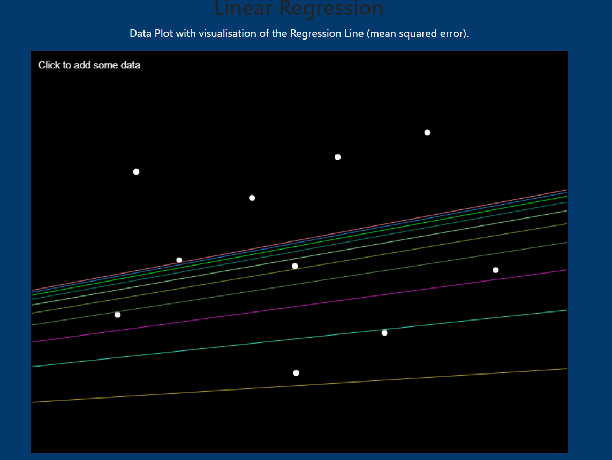
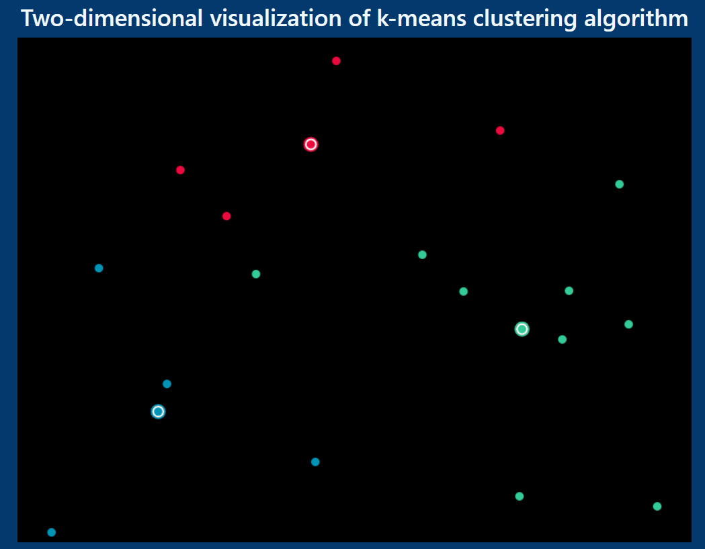

# Linear-Regression
This repository contains the source code for the visualisation of various machine learning algorithms using javascript.
The algorithms are Linear Regression,KNN and k-Means.
#### Linear Regression
Its a supervised machine learning algorithm which tries a find a linear relationship between the input variables (independent variables) and the output variable(dependent variable).
Here is a quick demonstration where on each turn the algorithm is run for 10 times and each time the predicted line gets close to the optimal solution.

#### K-Nearest Neighbours
It is an unsupervised machine learning algorithm where we are given certain data points and we try to find clusters within those data points and predicted the new data point's class based on the k nearest neighbours.
The demonstration is inspired by this deployment of the same on [Codepen](https://codepen.io/Qbrid/pen/OwpjLX).

#### K-Means
It is an unsupervised machine learning algorithm where we are given certain data points as well as the centres for the classes(these can be actual centroids or can be randomly guessed ones as well.) and we try to find the class of the data points based on which cluster its closest to.At the end of each loop the cluster positions need to be updated
Here is a quick demonstration.

